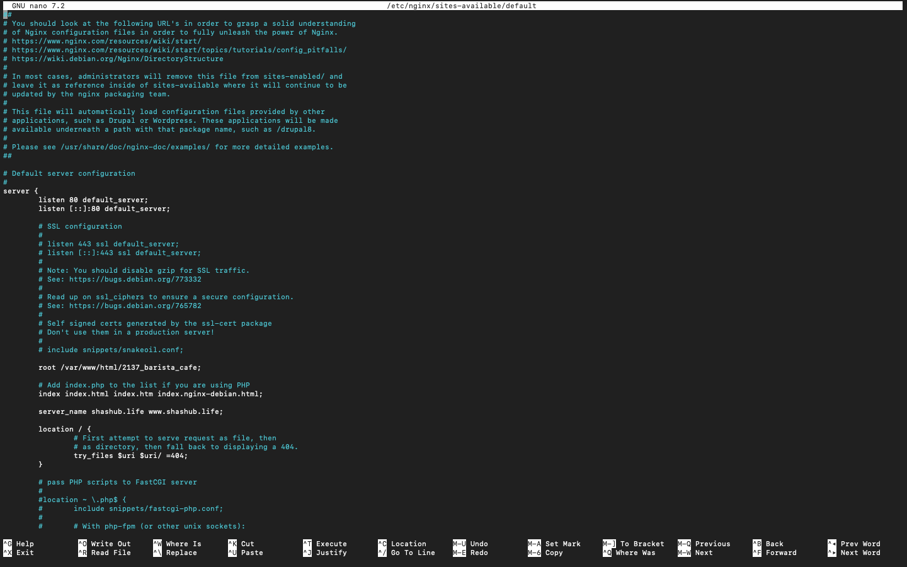
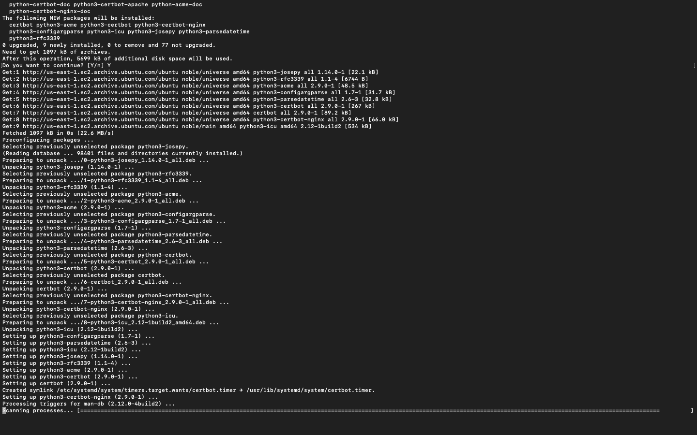

## Documentations

# Go to the aws management console
And type in the search Ec 2 and click on it
)

# And now in the Ec 2 dashboard 
click on launch instance 
)

# And now name your server
And also choose ubuntu server and scroll down
)

# After scrolling down you should see create key pair login
click on it 
)

# Now in create key pair 
choose the name for your key pair and click on it then scroll down
)

# After scrolling down you should see network settings 
click on all the unchecked checkboxes then scroll down
)

# After scrolling down you should see view all instances
click on it 
)

# Now you should see actions,instance id,etc
click on instance id
)

# Now in instance id 
click on conncet
1[9]()

# Now in connect
click on SSH client
)

# Now in SSH client
copy the example link
)

# Now go the folder your .pem file was downloaded and click on it and open with terminal
and now paste the link you copied
)

# Go bact to the aws manangement console
)

# Now here click on search
And search elastic ip 
1[14]()

# And now in elastic ip 
click on allocate ip address
)

# Then scroll down
keep all the settings unchanged and click allocate
)

# then click on associate this elastic ip
)

# After clicking on it scroll down and  click on associate 
)

# Install Nginx and Setup Your Website
Execute the following commands.

sudo apt update

sudo apt upgrade

sudo apt install nginx

Start your Nginx server by running the sudo systemctl start nginx command, enable it to start on boot by executing sudo systemctl enable nginx, and then confirm if it's running with the sudo systemctl status nginx command.
)

# Go back to your EC2 dashboard and copy your Public IPv4 address.
)

Visit your instances Public IPv4 address in a web browser to view the default Nginx startup page.
)

Download your website template from your preferred website by navigating to the website, locating the template you want, and obtaining the download URL for the website.

## Go to tootplate website to get the website template to show on your website
And choose any template of your choice but i chose the barista cafe own click on it
)

# After clicking on it
Scroll down to the download section, right-click to open the menu, and select Inspect from the options.
)

# Select the Network tab.
)

 # Click the Download button

 # After its done downloading
 in the network tab click on the zip file and choose copy and under copy choose copy url
 )

# Run this command sudo curl -o /var/www/html/2137_barista_cafe.zip https://www.tooplate.com/zip-templates/2137_barista_cafe.zip to download the websites file to your html directory.
)

# To install the unzip tool, run the following command: sudo apt install unzip.
)

# Navigate to the web server directory by running the following command: cd /var/www/html.

# Unzip the ocntents of your websites by running the command sudo unzip website template
)

 # Update your nginx configuration by running the command sudo nano /etc/nginx/sites-available/default. Then, edit the root directive within your server block to point to the directory where your downloaded website content is stored.
 )

# edit the root directory ro the new one
)

# Restart Nginx to apply the changes by running: sudo systemctl restart nginx.

 # Open a web browser and go to your Public IPv4 address/Elastic IP address to confirm that your website is working as expected.

# Create An A Record
To make your website accessible via your domain name rather than the IP address, you'll need to set up a DNS record. I did this by buying my domain from Namecheap and then moving hosting to AWS Route 53, where I set up an A record.

# note
I use godaddy for the domain name

# Type godaddy dashboard
click on the fisrt link
)

# Then you will see domain name
click on the one you want to manage
)

 # Go back to your AWS console, search for Route 53①, and then choose Route 53② from the list of services shown.
)

# Click on Get started.
)

# Select Create hosted zones① and click on Get started②.
)

 # Enter your Domain name①, choose Public hosted zone② and then click on Create hosted zone③.
 )

 # Select the created hosted zone① and copy the assigned Values②.
 )

 #Paste the values you copied from Route 53 into the appropriate fields
 )

# Head back to your AWS console and click on Create record.
)

 # Paste your Elastic IP address and then click on Create records.
)

 # Your A record has been successfully created.
()

# Click on create record again, to create the record for your sub domain.
()

# Input the Record name(www➀), paste your IP address➁, and then click on Create records➂.

 # Open your terminal and run sudo nano /etc/nginx/sites-available/default to edit your settings. Enter your domain and subdomain names, then save the changes.
 ()

 # Restart your nginx server by running the sudo systemctl restart nginx command Then visit your websites

# install cetrbot to make your website secure
Install certbot by executing the following commands: sudo apt update sudo apt install certbot python3-certbot-nginx
()

# Execute the sudo certbot --nginx command to request your certificate. Follow the instructions provided by certbot and select the domain name for which you would like to activate HTTPS.

